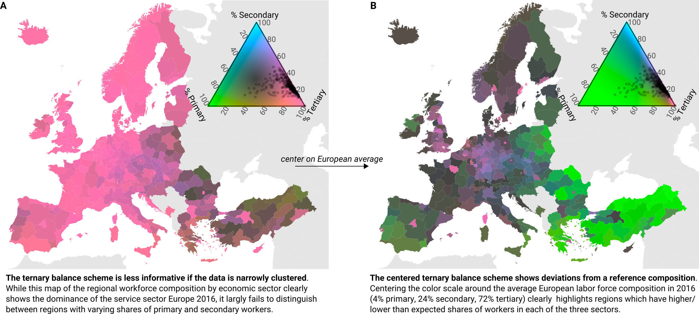

The centered ternary balance scheme: A technique to visualize surfaces of unbalanced three-part compositions
================
Jonas Schöley

BACKGROUND
  : The ternary balance scheme is a visualization technique that encodes three-part compositions as a mixture of three primary colors. The technique works best if the compositional data are well spread out across the domain but fails to show structure in very unbalanced data.

OBJECTIVE
  : I extend the ternary balance scheme such that it can be utilized to show variation in unbalanced compositional surfaces.

METHODS
  : By reprojecting an unbalanced compositional data set around its center of location and visualizing the transformed data with a standard ternary balance scheme, the internal variation of the data becomes visible. An appropriate centering operation has been defined within the field of compositional data analysis.

RESULTS
  : Using Europe's regional workforce structure by economic sector as an example, I have demonstrated the utility of the centered ternary balance scheme in visualizing variation across unbalanced compositional surfaces.

CONTRIBUTION
  : I have proposed a technique to visualize the internal variation in surfaces of highly unbalanced compositional data and implemented it in the [tricolore](https://cran.r-project.org/web/packages/tricolore/index.html) R package.

## Code

- `code/01-download_euro_data`: Download geodata for European NUTS-2 regions and associated statistics on workforce and educational attainment.
- `code/02-create_euro_basemap`: Create a flat map of Europe.
- `code/03-create_figures`: Create figures featured in paper.

## Data

Eurostat data, downloaded on March 5, 2020.

- `data/euro_education.csv`: Relative share of population ages 25 to 64 by educational attainment in the European NUTS-2 regions 2016. Data derived from Eurostat table "edat_lfse_04", downloaded on March 5, 2020.
  - `id`: NUTS-2 code
  - `ed_0to2`: Share of population with highest attained education "lower secondary or less".
  - `ed_3to4`: Share of population with highest attained education "upper secondary".
  - `ed_5to8`: Share of population with highest attained education "tertiary".
- `data/euro_sectors.csv`: Relative share of workers by labor-force sector in the European NUTS-2 regions 2016. The original NACE (rev. 2) codes have been recoded into the three sectors "primary" (A), "secondary" (B-E & F) and "tertiary" (all other NACE codes). Data derived from Eurostat table "lfst_r_lfe2en2", downloaded on March 5, 2020.
  - `id`: NUTS-2 code
  - `lf_pri`: Share of labor-force in primary sector.
  - `lf_sec`: Share of labor-force in secondary sector.
  - `lf_ter`: Share of labor-force in tertiary sector.
- `data/euro_geo_nuts2.RData`: A [simple-features](https://cran.r-project.org/package=sf) dataframe containing the NUTS-2 level polygons of European regions. Derived from Eurostat European Geodata. (c) EuroGeographics for the administrative boundaries (http://ec.europa.eu/eurostat/web/gisco/geodata/reference-data/administrative-units-statistical-units/), downloaded on March 5, 2020.
  - `id`: NUTS-2 code.
  - `name`: Name of NUTS-2 region.
  - `geometry`: Polygon outlines for regions in `sf` package format.
- `data/euro_basemap.RData`: A `ggplot` object representing a simple map of Europe.
