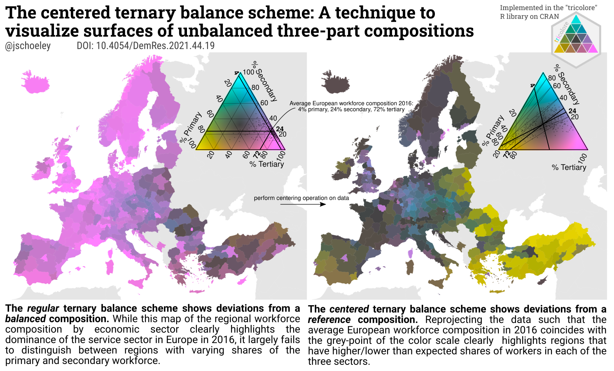

The centered ternary balance scheme: A technique to visualize surfaces of unbalanced three-part compositions
================
Jonas Schöley

BACKGROUND
  : The ternary balance scheme is a visualization technique which encodes three part compositions as a mixture of three primary colors. The technique works best if the compositional data is well spread out across the domain. However, to my knowledge no rescaling operation has been proposed thus far to effectively visualize the internal variation in unbalanced three-part compositions.

OBJECTIVE
  : I extend the ternary balance scheme such that it can be used to show compositional variation in unbalanced compositional data.

METHODS
  : By centering an unbalanced compositional data set on their average and visualizing the transformed data with a standard ternary balance scheme the internal variation of the data becomes visible. The centering operation is straightforward and was originally defined within the field of compositional data analysis.

RESULTS
  : Using Europe’s regional laborforce structure by economic sector as an example I’ve demonstrated the utility of the centered ternary balance scheme in showing internal variation of narrowly clustered data.

CONCLUSIONS
  : The centered ternary balance scheme is a promising approach to visualize unbalanced three-part compositions on a surface. While theoretical arguments can be made supporting the perceptual qualities of this novel technique it needs user-testing to empirically show the technique’s effectiveness in supporting the interpretation unbalanced compositional data across a surface.

CONTRIBUTION
  : With the centered ternary balance scheme I've proposed a visualization technique capableof showing the divergence of a three part composition with respect to a reference composition. The technique can be utilized to show the internal variation of highly unbalanced compositional data and has been implemented in the R package [tricolore](https://github.com/jschoeley/tricolore).
