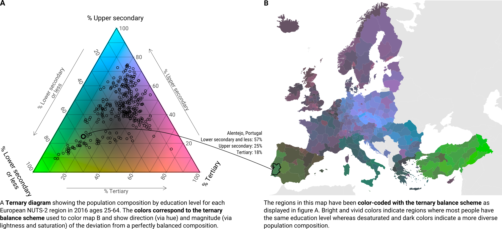
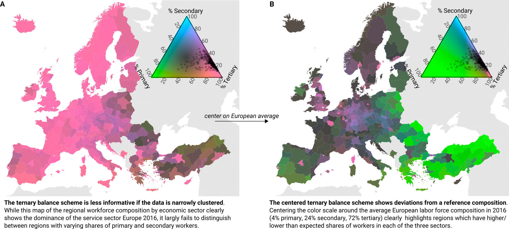
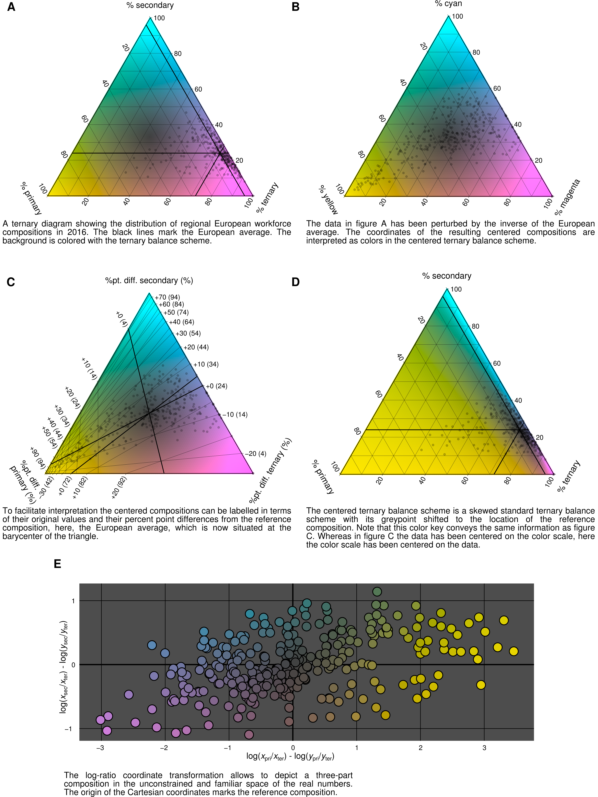

Problem description and proposed solution
=========================================

When it comes to compositional data, the number "three" is quite significant: the share of people working in the primary vs. secondary vs. tertiary sector, the proportion of total population change explained by migration vs. fertility vs. mortality, the relative population numbers in young age vs. working age vs. retirement age, the share of a cohort attaining primary vs. secondary vs. tertiary education degrees, the relative number of deaths due to prematurity vs. accidents vs. old age, the share of papers accepted as is vs. revised vs. rejected... It comes to no surprise that compositional data often comes in *ternary* form, i.e. featuring three parts, as the simplicity of a ternary classification scheme facilitates data collection and comparability. Ternary compositions are often available by period, age and/or geographical region leading to the challenge of *visualizing ternary compositions on a surface*, i.e. the surface of the Earth or the period-age Lexis surface.

The *ternary balance scheme* [@Brewer1994, see @Kashnitsky2018, @Schoeley2017, @Dorling2012, @Stott2003 for applications of that scheme] is a color scale suited to the visualization of three part compositions on a surface. It works by expressing the relative shares among three parts as the mixture of three primary colors. Figure 1B shows the proportions of people with either primary, secondary or tertiary educational attainment in Europe in 2016. Primary degrees are mapped to green, secondary to blue, and tertiary to red. The deeper the green in a region, the higher the share of people with primary education in that region, the same logic applies for the two other education categories. The more grayish a region is colored, the more balanced the three proportions are with a perfect grey signifying an equal share of people in all three education categories. A ternary diagram is used as a color key (figure 1A).

While the ternary balance scheme allows for incredibly dense yet clear visualizations of *well spread out* ternary compositions the technique is less informative when used with highly *unbalanced data*. Figure 2A shows the regional labor force composition in Europe as of 2016. The map is nearly monochromatic, the intense pink signifying a working population which is concentrated in the tertiary (services) sector. Regions in Turkey and Eastern Europe show a somewhat higher concentration of workers in the primary (production) sector but overall there is little variation with regards to the *visual reference point*, i.e. the grey-point marking perfectly balanced proportions.

A remedy for analyzing data which shows little variation in relation to some reference point is to *change the point of reference*. Figure 2B yet again shows the European regional labor force composition in 2016 but the color scale has been altered so that its grey-point -- the visual point of reference -- is positioned at the European annual average. Consequently the colors now show direction and magnitude of the deviation from the European average labor force composition. Green, blue and pink hues signify a higher than average share of workers in the primary, secondary and tertiary sector respectively. The saturation of the colors encode the magnitude of that deviation with perfect grey marking a region that has a labor force composition equal to the European average, i.e. the reference point.

In the following I discuss how to center ternary compositional data to arbitrary reference points and how to plot the compositions using a corresponding *centered ternary balance scheme*.

 

Centering of compositional data
===============================

Say you have a series of temperature readings for each day of a year and want to show how each reading compares to the yearly average. By subtracting the annual average from each data point you create a mean standardized variable representing direction and magnitude of the temperature deviation from the mean with a reference point at zero. Alternatively you could divide by the mean, putting the reference point at unity, to show the relative deviations. A similar standardization is possible for compositional data: the *pertubation by the inverse of the reference composition*.

For compositional data a natural reference point is a perfectly balanced composition, i.e. a composition of $K$ parts with each part equal to $1/K$. For a ternary composition this reference point is located at $(1/3, 1/3, 1/3)$ -- the barycenter of a ternary diagram -- and coincides with the position of the grey-point in a ternary balance scheme. The operation of *pertubation* allows to transform the ternary diagram such that an arbitrary composition can be located at the center [@VonEynatten2002], or in other words, *pertubation* centers compositional data around a new reference point. Let's demonstrate.

In 2016 the average European NUTS-2 region had 4% of the labor force working in the primary sector, 24% in the secondary and 72% in the tertiary sector. This composition $\textbf{c}=(0.04, 0.24, 0.72)$ shall be the reference against which all other compositions are compared. Figure 3A shows the labor force composition of all European regions in a ternary diagram with the European average annotated by lines.

Let $\textbf{p}_i = (p_1, p_2, p_3)_i$ be the labor force composition of region $i$. For each region we calculate $\textbf{p}'_i = \left(\frac{p_1/c_1}{\sum}, \frac{p_2/c_2}{\sum}, \frac{p_3/c_3}{\sum}\right)_i$, with $\sum_i = p_1/c_1 + p_2/c_2 + p_3/c_3$, i.e. we divide each element of the composition by the reference composition and then *close* the result so that it sums to unity. This sequence of operations is called the perturbation of $\textbf{p}_i$ by the inverse of $\textbf{c}$ and *centers* $\textbf{p}_i$ around $\textbf{c}$ with $\textbf{c}$ moving to the barycenter of the ternary diagram. Figure 3B shows the centered European regional labor force compositions.

The centered ternary balance scheme
===================================

The construction of the centered ternary balance scheme is straightforward, one needs but two ingredients: the ability to colorize a ternary composition with the regular ternary balance scheme^[The simplest way to achieve this is to interpret the composition as coordinates in the rgb color space. A more flexible method is described in @Schoeley2017.], and the ability to pertubate a ternary composition by the inverse of a reference composition as proposed by @VonEynatten2002 and described above. One first performs the perturbation of the compositional data set, thereby centering the data on the reference composition, and then colorizes the perturbed data according to the regular ternary balance scheme.

The resulting colors show for each composition on the ternary diagram the direction and magnitude of deviation from the reference composition. The hue of the color encodes which part(s) of a three part composition are greater than the reference composition. The lightness and saturation of a color show the distance of a composition from the reference with the reference composition itself colored grey.

How to draw an informative color key for the centered ternary balance scheme? Simply plotting the centered compositions in a ternary diagram with a ternary balance scheme background (see figure 3B) -- while correct -- isn't very intuitive as the centered compositions can not be easily interpreted^[The same situation arises when a logarithmic scale is labelled with the logged values as opposed to the values on the original scale.]. A better option is to plot the centered data in a ternary diagram but to label the scales of the diagram such that the original proportions can be read (see figure 3C). Because the centering operation skews the grid-lines in a ternary diagram, centered grid-lines have to be plotted [@VonEynatten2002]. The grid-lines can also be labelled with the percent-point-difference to the reference composition. To do so one generates a set of grid-lines crossing at the reference composition $\textbf{c}$ and from there draws additional grid-lines on each axis spaced 0.1 units apart in both directions. Subtracting the reference composition from those grid-line positions results in a grid that is centered at $(0, 0, 0)$ and shows the positive or negative percent point difference of a location on the ternary surface to the reference composition. Each point on such a ternary surface sums up to 0. A third option is to plot the uncentered data in the standard ternary diagram and to perturb the background color surface instead, shifting its grey-point from the barycenter of the triangle to the location of the reference composition (figure 3D).

Discussion
==========

With the centered ternary balance scheme I've proposed a visualization technique capable of showing the divergence of a three part composition with respect to a reference composition and has -- to my knowledge -- never been proposed before. The technique can be utilized to show the internal variation of a data set which is narrowly clustered on a global scale (as demonstrated in figures 1c and d) or to compare a composition against a standard (i.e. by centering the regional distribution of educational attainment in plot 1b around the European average of 1980).

The centered ternary balance scheme is a straightforward synthesis of the three variable balance scheme as described by @Brewer1994 and the centering operation applied in the context of compositional data analysis in the ternary diagram [@VonEynatten2002]. There is future opportunity for further synthesis, i.e. direction and magnitude of *compositional change over time* can be visualized by perturbing each data point at $t_1$ by the corresponding composition at $t_2$ and colorizing the resulting perturbation using the standard ternary balance scheme.

Neither the ternary balance scheme nor its centered extension have been empirically tested with regards to their effectiveness for the visualization of compositional data on a surface, but visualization theory gives some insight into potential strengths and weaknesses of the technique. The ternary balance technique uses the visual attribute *color* as a multidimensional encoding for the three parts that make up a ternary composition, mapping each part of the composition to a separate primary color channel. Is it possible for a reader of the visualization to separate the ternary colors into their three primaries, thereby perceiving the relative magnitude of each compositional part separately? The answer is *no*. Color primaries are known to be *integral*: they are perceived jointly and are hard to separate [@Ware2013]. Therefore the ternary balance technique should not be used in situations where it is important to precisely identify the relative shares of three components. However, the scheme can also be interpreted as a hue-(lightness/chroma) encoding. While hue signifies a qualitative attribute -- the dominant part(s) of the composition -- lightness and chroma redundantly encode the distance of a compositional observation from a reference composition -- a quantitative attribute. Hue and lightness can be separated to some degree, as illustrated by color-names such as "light-blue", "dark-green" and so forth... Interpreting the hues and lightness components of a map colored with the ternary balance scheme allows numerous relevant tasks to be performed:

1. **Identification of regions close to the reference composition.** Locate dark and grey regions.
2. **Identification of regions deviating from the reference composition.** Locate bright and colorful regions.
3. **Classification of regions deviating from the reference composition.** Identify the hue of the region and associate with their corresponding part(s) of the composition.
4. **Identification of compositional spatial gradients.** Locate color gradients.
5. **Classification of compositional spatial gradients.** Identify the starting hue and ending hue of the gradient. Associate the starting and ending hue with their corresponding part of the composition.
6. **Identification of compositional spatial discontinuities.** Locate sudden shifts in hue and/or lightness.
7. **Classification of compositional spatial discontinuities** Identify the hues at both sides of the discontinuity and associate them with the corresponding part of the composition.

None of the above tasks require the reader to perform the impossible feat of decomposing of a color into its primary constituents. The identification tasks 1 and 2 can be performed solely by comparing lightness levels. Identification tasks 4 and 6 require to judge the dissimilarity of neighboring colors. Classification tasks 3, 5 and 7 require the rough matching of two hues. All of these perception and cognitive tasks can also be found in established visualization techniques, therefore I hypothesize that they can also be performed on the ternary balance scheme. Empirical evidence has to be collected to support that claim.

Whenever hue is used as a visual encoding consideration has to be given to people with impaired color vision. Because the ternary balance scheme relies on the mixture three distinct primaries the resulting space of possible colors will necessarily contain colors which are non-discriminable by people with impaired color vision. The most common form of color-blindness reduces the sensitivity to green light, making it hard to distinguish colors along the red-green spectrum [@Birch2012]. If the compositional data set does not cover the whole surface of the ternary legend then it may be possible to choose the primary colors such that the data falls outside of the red-green spectrum.

The technique described in this paper has been implemented in the R package "tricolore" [@Schoeley2018]. Given a three column matrix of three part compositions "tricolore" returns a vector of colors along with a suitable color key. I hope that this implementation encourages people to experiment with this novel visualizations technique. Three part compositions are plenty and surfaces, whether defined by longitude and latitude or by period and age, provide plenty of room to find interesting variation in the data.
