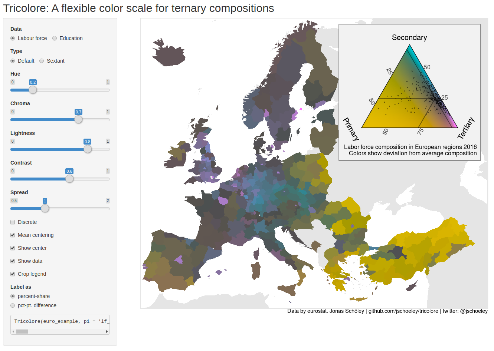

```{r setup, include=FALSE}
knitr::opts_chunk$set(
  echo = FALSE,
  message = FALSE,
  warning = FALSE,
  cache = FALSE,
  dpi = 300,
  #out.width = '100%',
  fig.align='center'
)
```

Ternary diagrams and color schemes
==================================

When it comes to proportions, the number "three" is quite significant: the share of people working in the primary vs. secondary vs. tertiary sector, the proportion of total population change explained by migration vs. fertility vs. mortality, the relative population numbers in young age vs. working age vs. retirement age, the share of a cohort attaining primary vs. secondary vs. tertiary education degrees, the relative number of deaths due to prematurity vs. accidents vs. old age, the share of papers accepted as is vs. revised vs. rejected... three-part proportions of a whole, i.e., ternary compositions, are a type of data that is both ubiquitous and idiosyncratic enough as to warrant particular attention when it comes to presentation. The ternary diagram and its use throughout the sciences stand as a manifestation of this view.

Variably referred to as de Finetti-, simplex-, or triangle plot, the ternary diagram is based upon a coordinate system that maps each point within an equilateral triangle to a unique three-part composition and as such has found use wherever the problem domain spans three parts of a whole. The diagram emerged during the 18th century as a means of illustrating relative mixtures of primary colors [@Howarth1996]. It was subsequently adopted as the standard method to depict phase transitions in three-component alloys [@Bancroft1897], the genotype composition of a population [@DeFinetti1926], soil composition [@Davis1927], or the potential for flammability given different mixtures of three gases [@Zabetakis1965]. In the social sciences, ternary diagrams depict population compositions along demographic characteristics, with an early example appearing in the USSR's first census report showing the distribution of workers across labor market segments in various regions [@Kvitkin1932].

Wherever three-part compositions are available by geographical region or other pairs of ordered attributes such as cohort and age, one faces the challenge of visualizing ternary compositions on a surface such as the surface of the Earth or the period-age Lexis surface. The *ternary balance scheme* [@Brewer1994] is a color scale suited to that task. The technique encodes the relative shares among three parts as a mixture of three primary colors. Figure 1B shows the proportions of people with either "lower secondary or less," "secondary," or "tertiary" educational attainment by European region in 2016. Lower degrees are mapped to yellow, secondary to cyan, and tertiary to magenta. The more pronounced the yellow in a region, the higher the share of people with lower education. The same logic applies to the two other education categories. The more grayish a region is colored, the more balanced the three proportions are with a perfect grey signifying an equal share of people in all three education categories. A ternary diagram is used as a color key (see Figure 1A) and doubles as a visualization of the distribution of data marginalized over the geographical surface.

Published examples of the ternary balance scheme include maps of population compositions by political alignment, education and workforce status [@Dorling2012; @Graetz2019; @Brewer1994], geological maps of soil composition [@Metternicht2003], arctic sea ice coverage by type [@Denil2015] or land cover compositions by type of forest [@Pirzamanbein2020; @Steidinger2019]. @Schoeley2017 employed the scheme to visualize the distribution of deaths by cause among the French population on a period by age surface.

```{r fig.cap='Demonstration of the ternary balance scheme showing the composition of educational attainment by region in Europe 2016. Data by Eurostat.'}
knitr::include_graphics('figure1.pdf')
```

The challenge of unbalanced compositions
========================================

While the ternary balance scheme allows for incredibly dense yet clear visualizations of well spread out three-part compositions, the technique is less informative when used with highly unbalanced data. Figure 2A shows the regional workforce composition in Europe as of 2016. The map is almost monochromatic, the intense magenta signifying a working population concentrated in the tertiary (services) sector. Regions in Turkey and Eastern Europe show a somewhat higher concentration of workers in the primary (production) sector, but overall there is little variation with regards to the visual reference point, i.e., the grey-point marking perfectly balanced proportions.

A remedy for analyzing data that shows little variation in relation to some reference point is to adjust the point of reference. Figure 2B yet again shows the European regional workforce composition, but the data has been re-projected so that the center of the compositional point cloud, the average European workforce composition, coincides with the grey-point of the ternary balance scheme. Consequently, the colors now show the direction and magnitude of the deviation from that average. Yellow, cyan, and magenta hues signify a higher than average share of workers in the primary, secondary, and tertiary sectors. The saturation of the colors encodes the magnitude of that deviation with perfect grey marking a region with a workforce composition equal to the European average, i.e., the new reference point.

The *centered ternary balance scheme* emerges from an application of a regular ternary color-coding to transformed (centered) compositional data. In the following, I will explain its construction.

```{r fig.cap='Demonstration of the centered ternary balance scheme in comparison with the non-centered scheme showing the workforce composition by region in Europe 2016. Data by Eurostat.'}
knitr::include_graphics('figure2.pdf')
```

Perturbation and centering of compositional data
================================================

Given a series of temperature readings for each day of a year, one may want to show how each reading compares to the yearly average. By subtracting the annual average from each data point, a new variable is created representing direction and magnitude of the temperature deviation from the mean with a reference point at zero. For the domain of compositional data, a similar transformation goes by the name *perturbation*, and it has been proposed as a means of centering unbalanced observations in a ternary diagram [@VonEynatten2002; @PawlowskyGlahn2002].

When John Aitchison set out the principles of compositional data analysis [@Aitchison1982; @Aitchison1986; @PawlowskyGlahn2015] he used ternary diagrams to illustrate the appropriate sample space, a positive simplex. Compositions are defined as points in the simplex or equivalently as a vector $\mathbf{x}$ with positive elements $\langle x_1,\ldots,x_D \rangle$ constrained to sum to unity. Just like the operations of linear algebra are intuitively illustrated in the two dimensions of the Cartesian plane, coordinates in the ternary diagram change in reaction to operations on the corresponding simplex, one such operation being the *perturbation* of a composition $\mathbf{x}=\langle x_1, \ldots, x_D \rangle$ by another $\mathbf{y}=\langle y_1, \ldots, y_D \rangle$ defined as $\mathbf{x}\oplus \mathbf{y}=\mathcal{C}\langle x_1y_1, \ldots, x_Dy_D \rangle$, where $\mathcal{C}\langle x_1, \ldots, x_D \rangle = \left\langle\frac{x_1}{\sum_i^D x_i},\ldots, \frac{x_D}{\sum_i^D x_i}\right\rangle$ denotes the *closure* operation that imposes the unit-sum constraint via division of each vector element by the sum of all elements. Note that as a consequence of this definition the perturbation of any composition $\mathbf{y}$ by its inverse $\mathbf{y}^{-1}=\langle 1/y_1, \ldots, 1/y_D \rangle$ results in the neutral element $\mathbf{y}\oplus \mathbf{y}^{-1}=\langle 1/D, \ldots, 1/D \rangle$ which for a three-part composition coincides with the barycenter of a ternary diagram at $\langle 1/3, 1/3, 1/3 \rangle$. Thus, perturbation allows the transformation of coordinates in a ternary diagram such that an arbitrary composition can be relocated to the center, acting as a reference point against which all other compositions are compared. Whenever a compositional data set is perturbed by the inverse of its compositional mean the operation is known as *centering* -- a key component for the construction of the centered ternary balance scheme as it allows to color code the deviations from an average, thereby visualizing structure in surfaces of unbalanced data.

The centered ternary balance scheme
===================================

The construction of the centered ternary balance scheme is straightforward, one needs but two ingredients: 1) the ability to colorize a ternary composition with the regular ternary balance scheme, and 2) the ability to perturbate a ternary composition by the inverse of its compositional mean as proposed by @VonEynatten2002 and described above. One first performs the centering of the compositional data set and then colorizes the centered data according to the regular ternary balance scheme. In the following, I will demonstrate how these two operations resulted in the map of deviations from the average European workforce composition by region in 2016 (see Figure 2B) and propose several options for drawing an informative color key.

In 2016 the average European region had 4% of the workforce situated in the primary sector, 24% in the secondary, and 72% in the tertiary sector. This composition $\mathbf{y}=\langle 0.04, 0.24, 0.72 \rangle$ marks the reference against which all other compositions are to be compared.^[ In compositional data analysis, the standard measure of centrality is the vector formed by closure of the component-wise geometric means of the observed compositions. @VonEynatten2002 advocate for this measure to be used when centering data on the ternary diagram. I chose instead to calculate the average workforce distribution across sectors from the total numbers of workers in each sector across all EU regions. This takes into account the different population sizes in each region, with more populous regions contributing more to the average. The component-wise geometric mean is, however, nearly identical to the population-weighted mean. ] Let $\mathbf{x}_j = \langle x_{1j}, x_{2j}, x_{3j} \rangle$ be the workforce composition of region $j$ as shown in Figure 3A. For each region I calculate the perturbation $\mathbf{x}'_j = \mathbf{x}_j \oplus \mathbf{y}^{-1}$ shown in Figure 3B. The perturbed compositions are then color-coded according to a regular ternary balance scheme. The simplest way to achieve this is to interpret the composition as coordinates in the RGB color space, see e.g. @Wang2009 for such an approach. A more flexible method employed in this paper is described in @Schoeley2017 and implemented in the "R" library "tricolore" [@Schoeley2019a]. Based upon the CIE-Lch color space -- a transformation of CIE-Luv described in @Ware2013, chapter 4 -- the latter technique allows for different choices of primary colors and gives the user control over overall lightness levels and contrast while ensuring that all primary colors used in the mixing appear roughly equal in lightness and chroma. Additionally, in the CIE-Lch space, the color dimensions hue, lightness, and chroma can be manipulated truly independent of each other, a property not shared by the popular RGB or HSV color-spaces [@Zeileis2009].

The resulting colors show for each composition the direction and magnitude of deviation from the compositional mean. The hue of the color encodes which components of a three-part composition are greater than the average, whereas lightness and saturation indicate the distance of a composition from the average, which itself is colored grey.

```{r fig.cap='Different representations of the color key for the (centered) ternary balance scheme showing the workforce composition by region in Europe 2016. Data by Eurostat.'}
knitr::include_graphics('figure3.pdf')
```

There are multiple options for drawing an informative color key. Simply plotting the centered compositions in a ternary diagram with a color-coded background as in Figure 3B -- while correct -- is not very intuitive as the transformed compositions can not be easily interpreted^[The same situation arises when a logarithmic scale is labeled with the logged values as opposed to the values on the original scale.]. A better option is to plot the centered data in a ternary diagram with scale labels indicating the original proportions (see Figure 3C). Because the centering operation skews the grid-lines in a ternary diagram, centered grid-lines have to be plotted [@VonEynatten2002]. This is achieved by perturbing the ternary coordinates of the grid by the inverse of the center $\mathbf{y}$. As the colors encode deviations from the center, the grid-lines can accordingly be labeled with the percent-point difference from it. A third option is to plot the uncentered data in the standard ternary diagram and perturb the background color surface instead, shifting its grey-point from the barycenter of the triangle to the location of $\mathbf{y}$ (see Figure 3D).

A fourth legend style avoids the ternary diagram altogether and instead displays the log-ratio transformed compositions in Cartesian coordinates (Figure 3E). This style of legend may be preferred by an audience already familiar with the methods of compositional data analysis as defined by @Aitchison1982 who introduced the so-called (additive) log-ratio transform as a means to analyze compositions in the unconstrained and familiar space of real numbers. For a three part composition $\mathbf{x}$ it is defined as $\text{alr} \langle x_1, x_2, x_3 \rangle = \langle \log (x_1/x_3), \log (x_2/x_3) \rangle = \langle z_1,z_2 \rangle$ with inverse $\text{alr}^{-1}\langle z_1,z_2 \rangle=\mathcal{C}\langle \exp(z_1), \exp (z_2), 1 \rangle = \langle x_1, x_2, x_3 \rangle$. The transformation maps the three positive elements of the composition to an unconstrained pair of coordinates which may be visualized in a standard scatterplot. Notably, centering $\mathbf{x}$ by perturbing with $\mathbf{y}^{-1}$ is equivalent to subtracting $\text{alr}(\mathbf{y})$ from $\text{alr}(\mathbf{x})$ and applying the inverse transform to the result, illustrating the relationship between perturbation in the simplex and a simple translation of the origin in real coordinates [@Aitchison2005a].

Discussion
==========

With the centered ternary balance scheme -- a straightforward synthesis of the three variable balance scheme as described by @Brewer1994 and the centering operation applied in the context of compositional data analysis in the ternary diagram [@VonEynatten2002] -- I have proposed a visualization technique capable of showing the divergence of a three-part compositional surface from its average. The technique can display the internal variation of a data set, which is narrowly clustered (as demonstrated in Figure 2). More generally the centered scheme may also be employed to show the divergence from *any* point of reference via perturbation by the inverse of the reference composition, e.g., perturbing the regional distribution of educational attainment in Figure 1B by the average composition in the US would yield a map of compositional differences to the US average. Further, compositional change over time can be visualized by perturbing each data point at $t_2$ by the inverse of the corresponding composition at $t_1$ [@Aitchison2005a] and colorizing the resulting perturbation using the standard ternary balance scheme.

Neither the ternary balance scheme nor its centered extension has been empirically tested regarding the effectiveness of visualizing compositional data on a surface. However, visualization theory gives some insight into potential strengths and weaknesses of the technique. The ternary balance technique uses the visual attribute "color" as a multidimensional encoding for the three parts that make up a ternary composition, mapping each part of the composition to a separate primary color channel. Is it possible for a reader of the visualization to separate the ternary colors into their three primaries, thereby perceiving the relative magnitude of each compositional part separately? The answer is no. Color primaries are known to be integral: they are perceived jointly and are hard to separate [@Ware2013]. Therefore, the ternary balance technique should not be used in situations where it is essential to precisely identify the relative shares of three components. However, the scheme can also be interpreted as a hue-(lightness/chroma) encoding. While hue signifies a qualitative attribute -- the dominant part(s) of the composition -- lightness and chroma redundantly encode the distance of a compositional observation from a reference composition -- a quantitative attribute. Hue and lightness can be separated to some degree, as illustrated by color-names such as "light-blue," "dark-green," and so forth... Interpreting the hues and lightness components of a map colored with the ternary balance scheme allows numerous relevant tasks to be performed:

1. **Identification of regions close to the reference composition.** Locate dark and grey regions.
2. **Identification of regions deviating from the reference composition.** Locate bright and colorful regions.
3. **Classification of regions deviating from the reference composition.** Identify the hue of the region and associate with their corresponding part(s) of the composition.
4. **Identification of compositional spatial gradients.** Locate color gradients.
5. **Classification of compositional spatial gradients.** Identify the starting hue and ending hue of the gradient. Associate the starting and ending hue with their corresponding part of the composition.
6. **Identification of compositional spatial discontinuities.** Locate sudden shifts in hue and lightness.
7. **Classification of compositional spatial discontinuities.** Identify the hues at both sides of the discontinuity and associate them with the corresponding part of the composition.

None of the above tasks requires the reader to perform the impossible feat of decomposing a color into its primary constituents. The identification tasks 1 and 2 can be performed solely by comparing lightness levels. Identification tasks 4 and 6 require to judge the dissimilarity of neighboring colors. Classification tasks 3, 5, and 7 require the rough matching of two hues. All of these perception- and cognitive tasks can also be found in established visualization techniques. Therefore I hypothesize that they can also be performed on the ternary balance scheme. Empirical evidence has to be collected to support that claim.

Whenever hue is used as a visual encoding consideration has to be given to people with impaired color vision. Because the ternary balance scheme relies on the mixture of three distinct primaries, the resulting space of possible colors will necessarily contain colors that are non-discriminable by people with impaired color vision. The most common form of color-blindness reduces the sensitivity to green light, making it hard to distinguish colors along the red-green spectrum [@Birch2012]. If the compositional data set does not cover the whole surface of the ternary legend, then it may be possible to choose the primary colors such that the data falls outside of the red-green spectrum.



The technique described in this paper is implemented in the `R` package "tricolore" [@Schoeley2019a]^[Development takes place in a public repository at https://github.com/jschoeley/tricolore and the authors welcome suggestions and bug-reports.] which builds upon the facilities of the "ggtern" package [@Hamilton2018] to draw color-coded ternary diagrams. Given a three-column matrix of three-part compositions, "tricolore" returns a vector of colors and a suitable color key. The user may choose between discrete and continuous color scales, center the color scale around either the geometric mean of the provided data or an arbitrary reference composition, and experiment with different values for hue, lightness, chroma, and contrast. An online tutorial [@Schoeley2019b] explains how to use the software to create color-coded maps like those shown in this paper, and a user interface (see Figure 4) helps with picking suitable parameters for the color scale. Thus far the software has been used in publications to map regional deviations from the average European age-composition [@Kashnitsky2018; @Schoeley2019], disparities in regional education attainment in India and Nigeria [@Graetz2019], the cause of death distribution by period, age and region in Mexico [@Kashnitsky2019], and Vienna's district population mix by region of origin [@StadtWien2019]. I hope that "tricolore" continues to encourage people to experiment with this novel visualization technique -- three-part compositions are plenty and surfaces, whether defined by longitude and latitude or by period and age, provide ample room to find exciting variation in the data.

# Acknowledgements

My thanks go to the three reviewers who generously contributed their time and expertise. I would also like to thank Marie-Pier Bergeron Boucher and Jim Oeppen for their input regarding the analysis of compositional data and Ilya Kashnitsky, who inspired me to write this paper.
